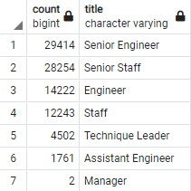
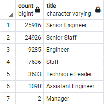

# Pewlett Hackard Retirement Analysis

## Overview of the Analysis
### Purpose
After completing the original analysis that has predicted a "silver tsunami" as Pewlett Hackard employees start to reach retirement age, our team was tasked to look deeper into the possible effects at a hierarchical level and ways to possibly mittigate the negative impact that a mass retirement of employees. We were specifically asked to find out the number of retirement age individuals by job title. We were also tasked with identifying employees that would be candidates for a mentoring program to assist new and younger employees as the company will have to adjust to this "silver tsunami".

## Results
Our analysis provided the following conclusions
    - Roughly 38% of Hewlett Packard employees are reaching retirement age
    - 50% of those who are near retirement age are Engineers
    - 45% have Staff titles
    - 64% of employees nearing retirement age are have senority titles
    - There are only 1,549 employees matching the criteria are eligible for the mentorship program

## Summary
### Filling Positions to be Vacated by Retirees 
According to our original analysis in this challenge, we would need to fill 90,398 jobs if we wanted to do a 1:1 replacement. If we wanted to only staff 90% of these posistions, we would look to hire roughly 81,400 new employees and 72,300 if we were looing to only fill 80% of these positions. This would be a good time to look at redundancies and efficiencies within the departments and company as a whole. However, when we did our analysis, we did a count on all employees and neglected to filter only current employees. That being said, we would still need to hire 72,458 new employees for a 1:1 ratio, 65,200 at 90% or roughly 58,000 at 80%.

#### Retiring Titles of Current Employees

#### Refactored Code for Retiring Titles

    --Refactor second table for deliverable 1 to account for ONLY current employees
    SELECT DISTINCT ON (emp_no) emp_no,
    first_name,
    last_name,
    title
    INTO current_unique_titles
    FROM retirement_titles 
    WHERE (to_date = '9999-01-01')
    ORDER BY emp_no, to_date DESC;

    -- Refactor third table for deliverable 1 to account for ONLY current employees
    SELECT COUNT(emp_no), title
    INTO current_retiring_titles
    FROM current_unique_titles
    GROUP BY title
    ORDER BY count DESC

### Eligibility for Mentorship Program
As noted above, if we only included people who were born in 1965 as eligible for the mentoring program, we would only have 1,549 candidates. If each candidate took on the roll of being a mentor and we ended up hiring the minimal ammount of replacements suggested above, each mentor would be helping roughly 37 new employees. However, if we increased the parameters for eleigibility to employees born between 1963 and 1965, our candidates increase to 38,401. If three-quarters of those eligible decided to participate in our mentorship program and we hired 1:1 for all of the current employees nearing retirement age, the ratio would be roughly 2.5 new hires for each mentor. This number seems much more realistic. It would also be an option to have some overlap and hire replacements for our future retirees before they leave their roles. 

#### Refeactored Code to Expand Eligibility

    --Expand parameters for mentorship program
    SELECT DISTINCT ON(e.emp_no) e.emp_no,
        e.first_name,
        e.last_name,
        e.birth_date,
        de.from_date,
        de.to_date,
        ti.title
    INTO expanded_mentorship_eligibility
    FROM employees AS e
    INNER JOIN dept_emp AS de
    ON (e.emp_no = de.emp_no)
    INNER JOIN titles AS ti
    ON (e.emp_no = ti.emp_no)
    WHERE (de.to_date = '9999-01-01')
        AND (e.birth_date BETWEEN '1963-01-01' AND '1965-12-31')
    ORDER BY e.emp_no, de.to_date DESC;
